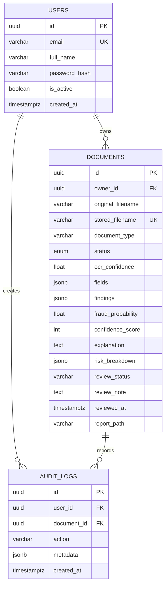

# Entity relationship diagram

```mermaid
erDiagram
  USERS ||--o{ DOCUMENTS : owns
  USERS ||--o{ AUDIT_LOGS : creates
  DOCUMENTS ||--o{ AUDIT_LOGS : records

  USERS {
    uuid id PK
    varchar email UK
    varchar full_name
    varchar password_hash
    boolean is_active
    timestamptz created_at
  }
  DOCUMENTS {
    uuid id PK
    uuid owner_id FK
    varchar original_filename
    varchar stored_filename UK
    varchar document_type
    enum status
    float ocr_confidence
    jsonb fields
    jsonb findings
    float fraud_probability
    int confidence_score
    text explanation
    jsonb risk_breakdown
    varchar review_status
    text review_note
    timestamptz reviewed_at
    varchar report_path
  }
  AUDIT_LOGS {
    uuid id PK
    uuid user_id FK
    uuid document_id FK
    varchar action
    jsonb metadata
    timestamptz created_at
  }
```

The detailed PostgreSQL DDL, including indexes and score constraint, is in [database/schema.sql](../database/schema.sql).
